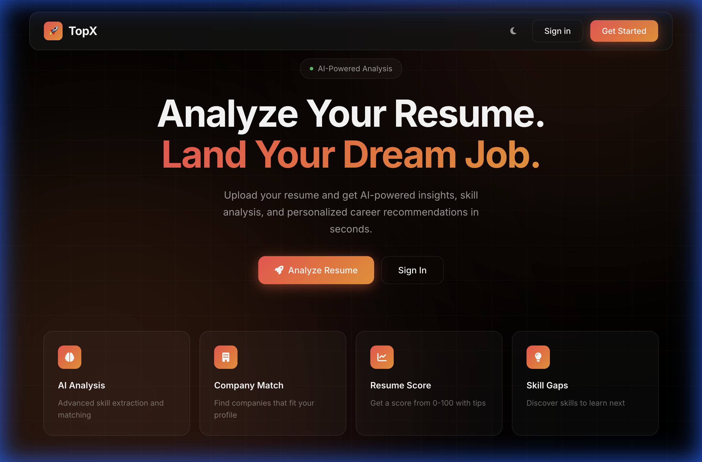

# 🚀 TopX - AI Resume Analyzer

An AI-powered resume analyzer that extracts skills, matches you with top companies, and recommends career paths.



## ✨ Features

- **AI Skill Extraction** - Automatically detects 60+ technical skills from your resume
- **Company Matching** - ML-powered predictions for TCS, Infosys, Wipro, and more
- **Resume Score** - Get a 0-100 score with visual gauge
- **Skill Gap Analysis** - Discover what skills to learn for your target roles
- **30+ Job Roles** - Python Developer, ML Engineer, DevOps, and more
- **PDF Export** - Download your analysis as a PDF

## 🛠️ Tech Stack

| Category | Technology |
|----------|------------|
| Backend | Flask, Flask-SocketIO |
| ML | scikit-learn (RandomForest) |
| PDF Parser | pdfminer.six |
| Frontend | HTML, CSS, JavaScript |
| Database | SQLite |

## 🚀 Quick Start

```bash
# Clone the repo
git clone https://github.com/yourusername/TopX-AI-Resume-Analyzer-Job-Recommendation.git
cd TopX-AI-Resume-Analyzer-Job-Recommendation

# Create virtual environment
python3 -m venv .venv
source .venv/bin/activate  # On Windows: .venv\Scripts\activate

# Install dependencies
pip install -r requirements.txt

# Run the app
python app.py
```

Open **http://localhost:5001** in your browser.

## 📁 Project Structure

```
├── app.py              # Flask app with routes & skill extraction
├── main.py             # ML model & job role predictions
├── requirements.txt    # Python dependencies
├── Book2.csv           # Training data for company prediction
├── linkedin skill      # Skills database
├── static/
│   └── style.css       # Premium dark theme styling
└── templates/
    ├── index.html      # Landing page with auth
    ├── upload.html     # Resume upload with drag-drop
    └── result.html     # Analysis dashboard
```

## 🎨 Design

- **Theme**: Pitch black (#000) with red-orange gradients
- **Style**: Minimal, professional, glassmorphism effects
- **Animations**: Floating elements, score gauge, shimmer effects

## 📊 How It Works

1. **Upload** - Drag & drop your PDF resume
2. **Extract** - AI extracts skills using keyword matching
3. **Analyze** - RandomForest model predicts company matches
4. **Results** - View score, skills, companies, roles, and gaps

## 🤖 ML Model

The company prediction uses a **RandomForest classifier** trained on ~950 resumes with features:
- Current CGPA
- Skills encoded
- Number of skills

Predicts top 3 matching companies from: TCS, Infosys, Wipro, Cognizant, Tech Mahindra, and more.

## 📝 License

MIT License - feel free to use and modify.

---

Built with ❤️ using Flask and scikit-learn